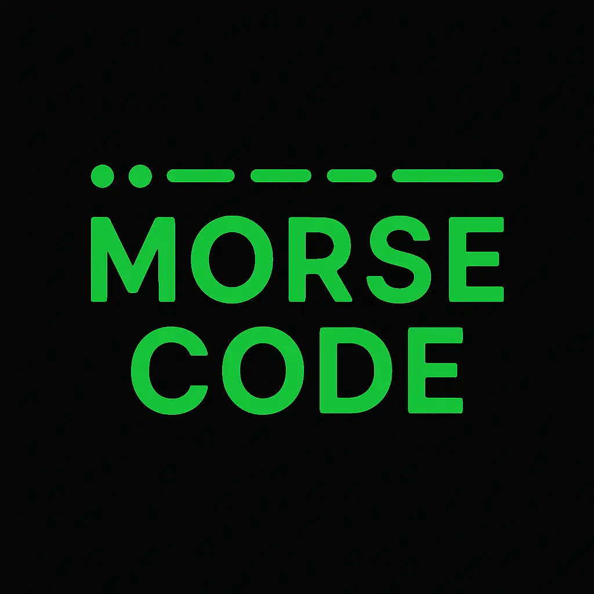
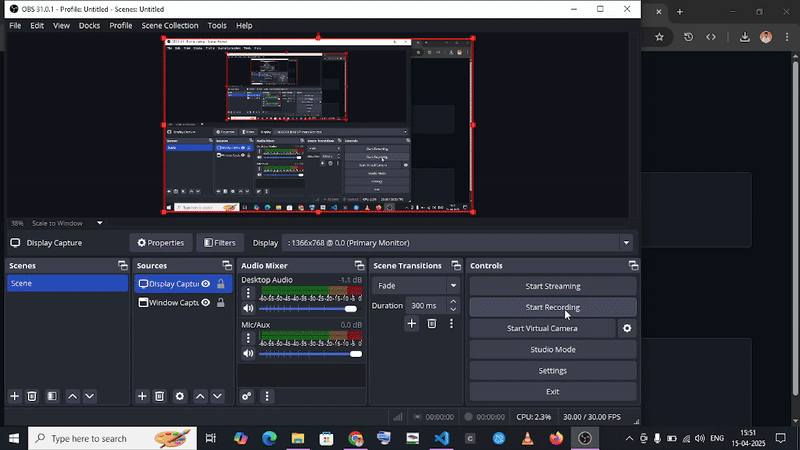

  

<h1 align="center">💡 Morse Code Converter</h1>

  🔤 Convert <strong>Text ⟷ Morse Code</strong> effortlessly with a modern, minimal UI  
   
  🚀 <a href="https://morse-converter-delta.vercel.app/"><strong>Live Demo</strong></a> |
  📁 <a href="https://github.com/DeveloperChetram/MorseConverter.git">Clone This Repo</a>

---

## 🖼️ Live Preview

  

---

## ✨ Features

- 🔄 Bi-directional conversion (Text ↔ Morse)
- 🌗 Clean, responsive, and dark-themed UI
- ⚡ Real-time conversion as you type
- 🧠 Simple logic yet beginner-friendly code

---

## 🛠️ Tech Stack

- ⚛️ HTML, CSS, JavaScript
- 📦 Deployed with Vercel

---

## 💬 Feedback & Contributions

Found a bug or want to suggest a feature?  
Feel free to open an [issue](https://github.com/DeveloperChetram/MorseConverter.git/issues) or submit a PR!  
Let’s make it even better together. 🤝
